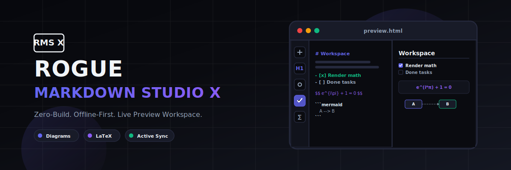
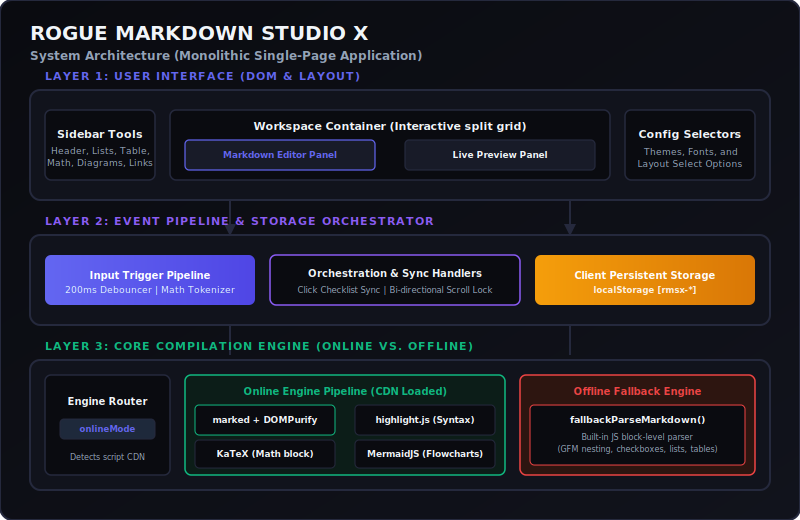
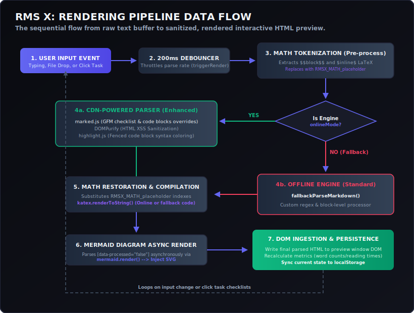

# Rogue Markdown Studio X

<p align="center">
  
</p>

<p align="center">
  <strong>A premium, zero-build, single-page, offline-first Markdown Editor and Live Preview Studio.</strong><br />
  Because you shouldn't need a 300MB node_modules folder just to write some text, render a flowchart, and format some equations.
</p>

<p align="center">
  <a href="https://kaelith69.github.io/rogue-markdown-studio-x/"><strong>⚡ Launch Live Demo</strong></a> | 
  <a href="#system-architecture">Architecture</a> | 
  <a href="#rendering-data-flow">Data Flow</a> | 
  <a href="#technical-specifications">Specs</a>
</p>

---

## What This Actually Does

**Rogue Markdown Studio X (RMS X)** is an in-browser Markdown editing workspace contained entirely within a single static HTML file (`preview.html`). It provides a split-screen dashboard to write Github Flavored Markdown (GFM) and compile it in real-time, complete with syntax highlighting, LaTeX mathematical typesetting, and Mermaid diagram visualization.

If you have an active network connection, the workspace dynamically hooks into CDNs to pull advanced parsers (`marked.js`), sanitizers (`DOMPurify`), typesetting libraries (`KaTeX`), and flowchart engines (`Mermaid`). If you lose connection or host the app locally offline, it detects the failure and gracefully degrades to a built-in custom line-by-line block parser. This guarantees that your editor stays active and readable, no matter your connectivity status.

All documents, layouts, typography configurations, and theme choices are stored directly in your browser's `localStorage` sandbox. No database, no tracking cookies, no server runtime.

---

## Actual Features

These are the features currently implemented in the codebase:

*   **Dual-Engine Parsing Pipeline:** 
    *   *Online Mode (Enhanced):* Compiles markdown using `marked.js` with full GFM compliance, sanitized via `DOMPurify` to block XSS injections.
    *   *Offline Mode (Standard):* Employs a custom block-level parser built in pure Javascript to translate headers, code blocks, lists, quotes, horizontal lines, images, and links if CDNs are unreachable.
*   **Interactive Task Lists:** Clicking checkbox items (`- [ ]` / `- [x]`) in the visual preview window automatically updates the corresponding markdown source line inside the text editor and syncs the changes to storage.
*   **Prevent-Lock Scroll Sync:** Editor and preview panels scroll together bi-directionally based on scroll-height percentages, equipped with scroll-source tracking to prevent recursive synchronization loop locks.
*   **Curated Aesthetics (5 Themes):**
    *   *Midnight Slate (Default):* Deep navy tones with glowing indigo highlights.
    *   *Rogue Brutalist:* High-contrast pure black and white styling.
    *   *Cyberpunk Neon:* A neon-drenched dark purple workspace with hot pink boundaries and cyan glow.
    *   *Earthy Forest:* A dark green, organic palette.
    *   *Solarized Light:* A clean, high-readability light theme.
*   **Typography Controls:** Instantly swap the workspace between Geometric Sans (*Plus Jakarta Sans*), Modern Tech (*Space Grotesk*), and Code-optimized (*JetBrains Mono*).
*   **Sidebar Quick-Insert Tools:** One-click buttons to inject headings, bold/italic markup, lists, code fences, blockquotes, links, images, tables, math blocks, and Mermaid graph templates.
*   **Auto-Saving State:** Auto-saves your content, theme selection, font layout, and split-screen mode to `localStorage` on every keystroke (debounced at 200ms).
*   **Document Statistics:** Dynamic footer calculating raw word count, character count, and estimated reading time.
*   **Print and PDF Engine:** Custom CSS override media queries optimized for browser print pipelines (`Ctrl+P` / Save as PDF) which cleanly hides the dashboard shell and formats the document into a professional, multi-page layout.
*   **Drag-and-Drop Loader:** Drag any `.md` or `.txt` file from your desktop directly onto the browser window to instantly load it into the editor.

---

## System Architecture

The application is architected as a clean vertical pipeline contained inside a single document. It avoids external bundlers, pre-compilers, or server runtimes.

<p align="center">
  
</p>

### Technical Components:
1.  **UI Component Layer:** Header controls, tool sidebars, and split panels styled using responsive CSS grid layouts and custom CSS variables.
2.  **Event Pipeline:** Synchronizes interactions (input changes, panel scroll events, file drops) and handles the 200ms debounce throttle window.
3.  **Engine Selector:** Inspects external script loading states and routes raw text to either CDN compilers (`marked`, `DOMPurify`, `KaTeX`, `Mermaid`) or the local regex fallback compiler.
4.  **Local Storage Interface:** Maintains state values persistently across page reloads.

---

## Rendering Data Flow

Here is the exact lifecycle mapping of what happens when you type or load text:

<p align="center">
  
</p>

1.  **Tokenization:** The script extracts math blocks (`$$...$$` and `$...$`) to protect special mathematical characters from being destroyed or altered during HTML parsing.
2.  **Compilation:** The text is parsed to HTML using either the CDN engine or the regex line compiler.
3.  **Sanitization:** The HTML output is sanitized via DOMPurify to keep the application safe from XSS.
4.  **Restoration:** Math placeholders are swapped back and typeset into beautiful equations via KaTeX.
5.  **Diagram Generation:** Any Mermaid flowchart syntax is parsed asynchronously using Mermaid's rendering API and injected as SVG nodes.
6.  **Persistence & UI update:** The DOM is updated, storage is written to, and reading statistics are computed.

---

## Technical Specifications

### 1. Interactive Sidebar Shortcuts
The quick-insert sidebar tools wrap selected text dynamically or insert drop-in templates at your cursor position:

| Tool | Action | Insert Behavior (Selection Wrapped / Default Template) |
| :---: | :--- | :--- |
| **H1** | Heading 1 | `# selection` |
| **H2** | Heading 2 | `## selection` |
| **H3** | Heading 3 | `### selection` |
| **B** | Bold Text | `**selection**` (defaults to `**bold**`) |
| **I** | Italic Text | `*selection*` (defaults to `*italic*`) |
| **S** | Strikethrough | `~~selection~~` (defaults to `~~strikethrough~~`) |
| **C** | Inline Code | `` `selection` `` (defaults to `` `code` ``) |
| **`</>`**| Code Block | ` ```javascript\nselection\n``` ` |
| **•** | Unordered List| `- selection` |
| **1.** | Ordered List | `1. selection` |
| **☑** | Checklist Item| `- [ ] selection` |
| **””** | Blockquote | `> selection` |
| **―** | Horizontal Line| `--- \n` |
| **🔗** | Insert Link | `[selection](https://)` |
| **🖼️** | Insert Image | `` |
| **田** | Insert Table | 2x2 markdown table skeleton |
| **∑** | Math Block | `$$\nselection\n$$` |
| **M** | Mermaid Graph | Flowchart diagram template (`A --> B`) |

---

### 2. Design System & CSS Theme Variables
RMS X features a fully reactive styling architecture using CSS Custom Properties. Developers looking to customize themes can leverage the following CSS token scheme used across the application:

```css
:root {
  --bg: #0a0b10;
  --panel: #11131c;
  --panel-head: #181b28;
  --line: #25293d;
  --text: #f1f5f9;
  --text-muted: #94a3b8;
  --accent: #6366f1;
  --accent-hover: #4f46e5;
  --accent-glow: rgba(99, 102, 241, 0.15);
  --shadow: 0 20px 40px rgba(0, 0, 0, 0.5);
  --radius-lg: 24px;
  --radius-md: 16px;
  --radius-sm: 8px;
}
```

The application overrides these variables dynamically based on the active body class (e.g. `body.theme-cyberpunk`):

| Variable | Midnight Slate | Rogue Brutalist | Cyberpunk Neon | Earthy Forest | Solarized Light |
| :--- | :--- | :--- | :--- | :--- | :--- |
| `--bg` | `#0a0b10` | `#080808` | `#05000a` | `#0d0f0e` | `#f8fafc` |
| `--panel` | `#11131c` | `#121212` | `#0e021a` | `#151b18` | `#ffffff` |
| `--panel-head`| `#181b28` | `#1c1c1c` | `#18042c` | `#1e2621` | `#f1f5f9` |
| `--line` | `#25293d` | `#333333` | `#ff007f` | `#2f3b33` | `#cbd5e1` |
| `--text` | `#f1f5f9` | `#ffffff` | `#f3e8ff` | `#f0fdf4` | `#0f172a` |
| `--text-muted`| `#94a3b8` | `#a0a0a0` | `#c084fc` | `#86efac` | `#64748b` |
| `--accent` | `#6366f1` | `#00ff66` | `#00f0ff` | `#4ade80` | `#2563eb` |
| `--accent-hover`| `#4f46e5`| `#00e65c` | `#00d8e6` | `#22c55e` | `#1d4ed8` |

---

### 3. Rendering Capability Matrix (Online vs. Offline)
When internet connectivity is lost or CDNs are blocked, the application falls back to its embedded custom compiler. Below is a breakdown of layout capabilities in each engine mode:

| Feature Element | Online Mode (Enhanced Engine) | Offline Mode (Standard Fallback) |
| :--- | :---: | :---: |
| **Headers (H1 - H6)** | Yes (`marked.js`) | Yes (Custom line parser) |
| **Emphasis & Striking** | Yes (`marked.js`) | Yes (Inline regex) |
| **Links and Images** | Yes (`marked.js`) | Yes (Inline regex) |
| **Syntax Highlighting** | Yes (`highlight.js`) | No (Unstyled code block) |
| **LaTeX Mathematics** | Yes (`KaTeX`) | Fallback block styling |
| **Mermaid Flowcharts** | Yes (`Mermaid.js`) | Syntax-raw code preview |
| **Markdown Tables** | Yes (`marked.js`) | Yes (Custom block compiler) |
| **Blockquotes** | Yes (`marked.js`) | Yes (Custom block compiler) |
| **GFM Checklists** | Yes (`marked.js` + override) | Yes (Indented nesting lists) |
| **Checkbox Sync Action** | Yes (Dynamic source-code toggle) | Yes (Dynamic source-code toggle) |

---

## Folder Structure

Behold the absolute complexity of the workspace folder layout:

```text
.
├── .github/
│   └── workflows/
│       └── static.yml         # GitHub Actions CI/CD Deployment Workflow
├── preview.html               # The entire application (HTML, CSS styling, Javascript logic)
├── README.md                  # This file
├── LICENSE                    # Permissive project license
├── banner.svg                 # Project banner asset
├── architecture-diagram.svg   # System architecture diagram
└── data-flow-diagram.svg      # Ingestion pipeline flow diagram
```

Yes, that is really it. No `node_modules`, no `src/` directories, no package configs.

---

## Installation & Local Development

No installer required. Simply clone the repository or download `preview.html` and open it:

```bash
# Clone the repository
git clone https://github.com/Kaelith69/rogue-markdown-studio-x.git

# Move into the folder
cd rogue-markdown-studio-x

# Open the editor directly in your default browser (macOS/Linux)
open preview.html

# On Windows (PowerShell)
Start-Process preview.html
```

---

## Developer Operations (Scripts)

Since there is no bundler or local server framework, there are no scripts to run. 

*   To run the app: Double-click `preview.html`.
*   To edit the source code: Open `preview.html` in your favorite IDE (like VS Code), make changes, and refresh the browser.
*   To test offline capabilities: Disable your internet connection or run the browser in Offline Mode via Chrome DevTools and reload the page.

---

## Configuration

The application is completely zero-configuration. Custom values are auto-saved to these local storage keys:
*   `rmsx`: Stores the active markdown text buffer.
*   `rmsx-theme`: Remembers the active UI theme (`default`, `brutalist`, `cyberpunk`, `forest`, `light`).
*   `rmsx-font`: Stores the typographic layout selection (`sans`, `serif`, `mono`).
*   `rmsx-layout`: Remembers the editor pane visualization (`split`, `editor`, `preview`).

---

## GitHub Pages Deployment

Rogue Markdown Studio X can be hosted on GitHub Pages in under a minute:

1.  Push the repository to GitHub.
2.  Navigate to your repository **Settings** tab.
3.  Scroll down to **Pages** in the left sidebar.
4.  Under **Build and deployment**, select **Deploy from a branch** as the source, choose your primary branch (e.g., `main`), select the root directory `/`, and click **Save**.
5.  Your page will be live at `https://<your-username>.github.io/<your-repository-name>/preview.html`.

*Tip: If you want the editor to load directly at the root URL (without needing `/preview.html` in the path), simply rename or copy `preview.html` to `index.html` and push it to your repository.*

---

## Technical Notes

### Marked Overrides (Token API Handling)
For Markdown parsing online, the application hooks custom overrides into `marked.js` using `marked.use()`. The custom parser is written to dynamically handle both older marked positional parameters and the newer `marked` v10+ token object representation:
*   **Codeblock Rendering (`renderer.code`):** Intercepts `.mermaid` code blocks and wraps them inside `<div class="mermaid-container">` blocks to defer execution to Mermaid's async renderer. All other languages are passed to `highlight.js`.
*   **Checklist Item Mapping (`renderer.listitem`):** Intercepts standard GFM list tokens, strips default checkboxes, assigns a sequential `data-idx` identifier, and injects interactive checkboxes that support line-index mapping back to the editor text.

### Synchronized Scrolling Algorithm
Scroll synchronization tracks the ratio of active scroll height to avoid compounding loops:
```javascript
const pct = editor.scrollTop / (editor.scrollHeight - editor.clientHeight);
preview.scrollTop = pct * (preview.scrollHeight - preview.clientHeight);
```
To prevent infinite scroll event feedback (where scroll on the editor triggers scroll on preview, which then triggers editor scroll), the handler locks execution to a single active source pointer (`scrollSource`), releasing the lock via a debounced timeout once scroll momentum finishes.

---

## Troubleshooting

### Equations/Diagrams not rendering, or says "Checking Engine..."
*   **Cause:** The application relies on CDN endpoints (`cdn.jsdelivr.net` and `cdnjs.cloudflare.com`) to load KaTeX, Mermaid, Highlight.js, and Marked. If you have no internet access, or if these CDNs are blocked by your network/firewall, the browser cannot run the enhanced engine.
*   **Fix:** The application will automatically degrade to **Offline (Standard)** mode. Basic markdown formatting will still render via the custom javascript parser, but math blocks and mermaid flowcharts will render as code blocks. To fix, restore your network connection or verify that CDN scripts can be downloaded.

### Exporting PDF results in a cut-off single page
*   **Cause:** The print layout requires the view panels to lose their absolute height bounds to let text flow naturally. If a script error or styling override forces `overflow: hidden` during printing, the browser will only print the visible fold.
*   **Fix:** Ensure your browser is updated. The print media query overrides in RMS X automatically strip out scroll wrappers, layout panels, sidebars, and headers during a print command. Make sure to use the "Export PDF" sidebar button or run standard browser print (`Ctrl+P`).

---

## FAQ

#### Can I use this app completely offline?
Yes! You can download `preview.html` to a local folder or flash drive. If you open it without internet access, the application detects CDN loading failures and starts the **Offline (Standard)** parsing engine. Your notes are kept safely inside local storage.

#### Is my data sent to any third-party servers?
Never. Rogue Markdown Studio X runs entirely inside your client browser sandbox. There is no back-end API or telemetric tracker. Even CDNs are requested as read-only static script assets.

#### How does the checklist interaction synchronize back to the raw markdown?
When you click a checkbox in the preview area, an event listener catches the click, resolves the sequential checkbox index from its `data-idx` property, search-replaces the corresponding markdown checkbox indicator (`[ ]` or `[x]`) in the editor textarea, and triggers a document redraw.

---

## License

This project is licensed under the [MIT License](LICENSE).

---

## Credits

*   Markdown Parser: [marked](https://github.com/markedjs/marked)
*   Typesetting: [KaTeX](https://github.com/KaTeX/KaTeX)
*   Diagrams: [Mermaid.js](https://github.com/mermaid-js/mermaid)
*   Code Highlighting: [highlight.js](https://github.com/highlightjs/highlight.js)
*   HTML Sanitizer: [DOMPurify](https://github.com/cure53/DOMPurify)

---

*Made with minimal dependencies and zero node_modules. Write freely.*
